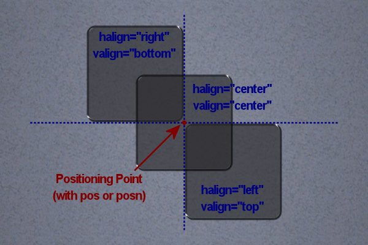

# Positioning
Trackmanai Forever features two positioning systems to be backwards compatible with Trackmania United ManiaLinks. In general, the center of the screen always resembles the `x=0` `y=0` position. Whenever possible you should use the **modern** positioning system as it enables a smaller range between two possible positions. Elements nested within others (such as [&lt;frame&gt;](../elements/frame.md)) add their position to the parents position.

## Modern (United Forever & Nations Forever)
The modern positioning system uses ``posn`` and ``sizen``.

### X (Vertical)
The `X` axis has a range of `-64` to `64` where higher values are closer to the **right** edge of the screen.

### Y (Horizontal)
The `Y` axis has a range of `-48` to `48` where higher values are closer to the **upper** edge of the screen.

### Z (Depth)
The `Z` axis has a range of `-32` to `32` where higher values resemble higher elements.

### Width
An elements width via `sizen` has a range of `0` to `128`. The default value is `64`.

### Height
An elements height via `sizen` has a range of `0` to `96`. The default value is `64`.

## Classical (United & Nations)
The classic positioning system uses ``pos`` and ``size``.

### X (Vertical)
The `X` axis has a range of `-1.00` to `1.00` where higher values are closer to the **left** edge of the screen.

### Y (Horizontal)
The `Y` axis has a range of `-0.75` to `0.75` where higher values are closer to the **upper** edge of the screen.

### Z (Depth)
The `Z` axis has a range of `-0.50` to `0.50` where lower values resemble higher elements.

### Width
An elements width via `size` has a range of `0.0` to `2.0`.

### Height
An elements height via `size` has a range of `0.0` to `1.5`.

## Z-Index
When two elements share the same position, one will be drawn above the other. To decide which element should be drawn in which order, you can use the `Z` axis. Imagine two elements at the same position. One of them has a `Z` value of `0` while the other has a value of `10`. The element with a `Z` value of `10` will always be drawn above the other.

!!! warning
    Keep in mind that the z-index is the other way around when using `pos` instead of `posn`.

## Alignment
It is possible to align various elements with the `halign` and `valign` attributes. It shifts the pivot point to one of nine possible locations which are the basis for the position of the element. The standard values for `halign` and `valign` are `left` and `top`, making the upper left corner the anchor for all elements unless otherwise specified.

