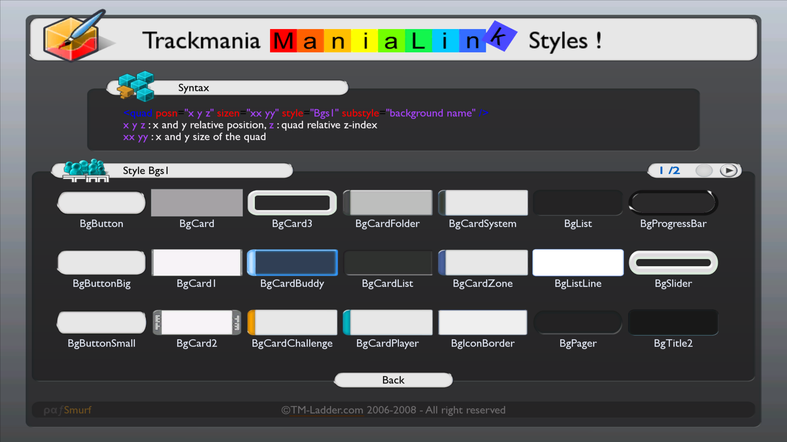

# Predefined Styles
Some elements have the attributes ``style`` and ``substyle`` which are used to apply premade stylings and icons. Please visit pafSmurf's ManiaLink `example` to see an ingame list and preview of available styles.

[Visit pafSmurfs `example` ManiaLink](tmup:///:example)

