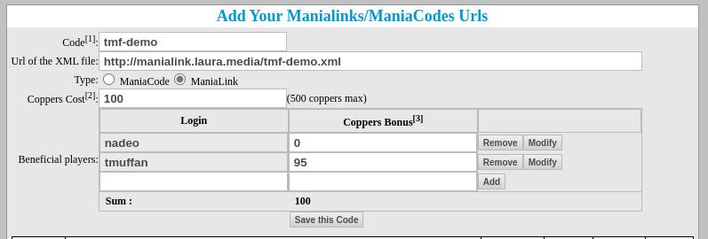

# Link Setup
You've created a ManiaLink and now you want to share it with other players, but you don't want to make them enter a full URL? Or do you want to create a ManiaCode to make players donate **Coppers** for ressources?

If your answer is yes to either of these questions, you need to register your ManiaLink on the [Trackmania Player Page](https://players.trackmaniaforever.com/).

!!! note
    Use the credentials you use to log into the game on the player page. Access is only available to Trackmania United Forever accounts.

## Check your ManiaLink
First, check that your ManiaLink is working propperly. You will need to host your ManiaLink somewhere, more details are available on the [Server Setup](server-setup.md) page.

## Register your ManiaLink

* Go to [Manialinks/ManiaCodes](https://players.trackmaniaforever.com/main.php?view=manialinks)
* Fill in the `Code` field, this will be the code players will need to enter to access your ManiaLink
* Now fill the full HTTP url of your ManiaLink's index file in the `URL` field.
* Decide whether your code is a [ManiaLink](../index.md#what-is-a-manialink) or a [ManiaCode](../index.md#what-is-a-maniacode)
* Enter the **Coppers Cost** if applicable
    * In the table below, enter the login names and the amount of Coppers they receive from the total coppers cost. This way, you can share the Coppers earned with multiple users.
* Click on **Save this Code**

This should be it. You can now go into the game and test out your newly created ManiaLink or ManiaCode.

!!! note
    Nadeo will always receive 5% of the **Coppers Cost**. For example, if your coppers cost is `100`, `95` will be given out to the users and `5` will be returned to Nadeo