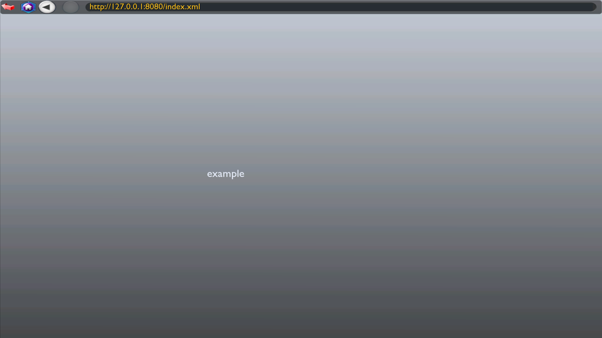

# Local Setup
In Trackmania Forever, ManiaLinks cannot be locally tested like in Trackmania 2. To work on a ManiaLink locally, you will need to have a simple HTTP server running to statically serve files or any other HTTP server for dynamic ManiaLinks. On this page, we will focus on a simple setup with a NodeJS HTTP server for local development.

!!! note
    You can also use Python or other languages to run the HTTP server. For simplicity, we will focus on a simple NodeJS server. [NodeJS](https://nodejs.org/) will need to be installed properly.


## Setup your project folder
First, we need to setup a project folder for our ManiaLink. Create a folder named `my-manialink` and a file named `index.xml` within it.

- my-manialink
    - index.xml

We can now create our ManiaLink in the `index.xml` file. Here is a simple example for testing purposes:

```xml
<?xml version="1.0" encoding="utf-8"?>
<manialink>
    <timeout>0</timeout>

    <label posn="-20 0 1" text="example" />
</manialink>
```

## Run the local server
To run a local server that serves our ManiaLink, run the following command in a terminal within your project folder: `npx http-server -c-1 -o ./`. Your default browser will open with a directory listing of the folder that will be served. By default, the server will run on port `8080`, so your created ManiaLink will be available on `http://127.0.0.1:8080/index.xml`.

!!! note
    If port 8080 is not available on your system, you can also specify a different port. Example: `npx http-server -p 1234 -c-1 -o ./`

## Open your ManiaLink
To open your ManiaLink, open Trackmania Forever and click on **Explorer**. Enter `http://127.0.0.1:8080/index.xml` on the input row at the top and your ManiaLink will open. You can now change your `index.xml` to make changes. To see these changes, re-enter `http://127.0.0.1:8080/index.xml` in the URL bar at the top.

